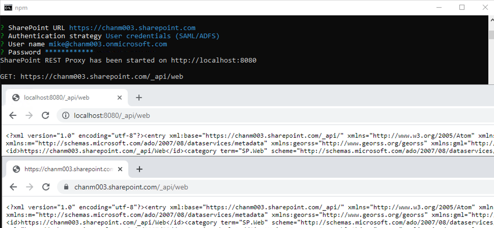
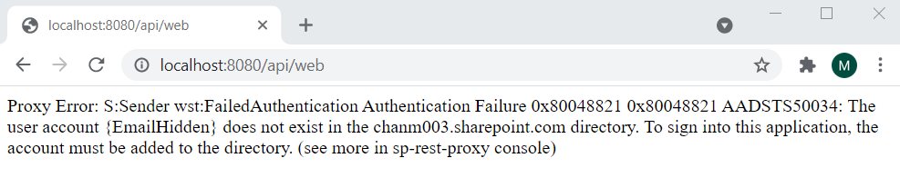
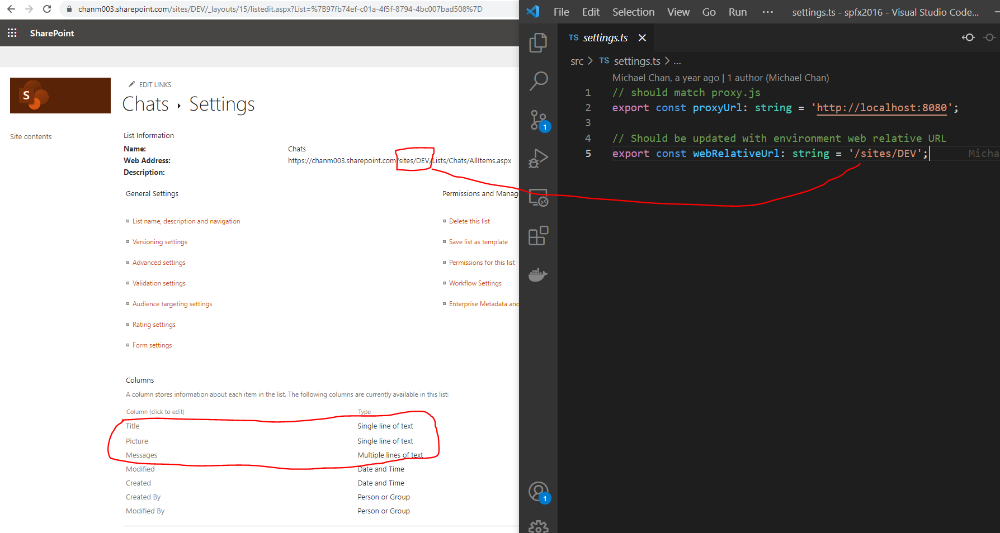

# spfx2016

SPFx sample app that targets SP2016 on-premise environment. Serves as guidance and how-to for common operations (create, read, update, delete) of list items.

## Screenshots

Once provisioned, this app provisions a single SharePoint list.


Query all list items.


Clicking on "Avery Stewart" below creates a new list item.


Query for a single list item.


Update a single list item.


Update a single list item again.


Query all list tiems.


## Setting up Windows Machine for SPFx Development

1. Install code editor [VSCode](https://code.visualstudio.com/)
2. Install NodeJS [NodeJS](https://www.nodejs.org)
3. Install Git [Git](https://git-scm.com/downloads)
4. Install Node Version Manager [NVM](https://github.com/coreybutler/nvm-windows)
5. Install required tools from npm

```
nvm install 10.20.1
nvm use 10.20.1
npm install -g gulp@3.9.1
npm install -g yo@1.8.5
npm install -g @microsoft/generator-sharepoint@1.9.1
npm install -g rimraf
```

### Get Source Code

```
cd ~/Desktop
git clone https://github.com/chanm003/spfx2016.git
cd spfx2016
npm install
```

### Cache SPO credentials for Proxy

The following steps need to be performed when you first clone the repository onto your local machine or whenever the password to your real SharePoint environment expires.

1. Cache credentials
   ```
   cd ~/Desktop/spfx2016
   npm run proxy
   ```
2. When prompted provide your credentials
   ```
   SharePoint URL https://chanm003.sharepoint.com
   Authentication strategy User credentials (SAML/ADFS)
   User name mike@chanm003.onmicrosoft.com
   Password *************
   ```
3. Verify private.json is generated
   - This file is in the `config` directory.
   - This file stores credentials in an encrypted manner.
   - This file is NEVER checked into source control.
4. Verify proxy server is returning the same XML data as your real SPO environment.
   
5. Repeat steps 1-4 as necessary if you receive the following authentication error.
   
6. Hit `Ctrl+C` to quit

### Manually create a list called "Chats" in SPO (DEV environment)

Update the `webRelativeUrl` property accordingly inside of `settings.ts`


### Run the App Locally during DEV

```
cd ~/Desktop/spfx2016
npm run bump:typescript
npm run serve
```

## Installing the App on SP2016

### Pre-requisites, obtain some URLs from SP2016 PROD/STAGING Environment

| URL                                                           |                              Example                               |
| ------------------------------------------------------------- | :----------------------------------------------------------------: |
| Document library/folder where you wish to keep bundled assets | http://socafrica.westeurope.cloudapp.azure.com/SPFxBundles/sp-2016 |
| App Catalog                                                   |  http://socafrica.westeurope.cloudapp.azure.com/sites/appcatalog   |
| Site where you wish to install App                            |           http://socafrica.westeurope.cloudapp.azure.com           |

### Get Source Code

```
cd ~/Desktop
git clone https://github.com/chanm003/spfx2016.git
```

### Edit CDN Base Path to match URL of document library/folder that you created

```
code ~/Desktop/spfx2016/config/write-manifests.json
```

### Build source code

```
cd ~/Desktop/spfx2016
nvm use 10.20.1
npm install
npm run bump:typescript
gulp build
gulp bundle --ship
gulp package-solution --ship
```

### Upload Build Artifacts to SP2016

| Source                                               |               Destination                |
| ---------------------------------------------------- | :--------------------------------------: |
| ~/Desktop/spfx2016/sharepoint/solution/sp-2016.sppkg |               App Catalog                |
| ~/Desktop/spfx2016/temp/deploy/\*                    | Document library/folder that you created |

### Add an App in Site Contents, Create Site Page, Insert Web Part

TBD

## Making Changes to Source Code, Running and Testing locally

TBD

## Configuring SP2016 Farm to Support SPFX

This section documents the steps for enabling SPFx development at the farm-level. Some or all of these requirements may have already been met by enabling the farm to support Add-Ins (i.e. App Catalog already exists).

### Install Feature Pack 2

1. Download and install [KB4011127](https://support.microsoft.com/en-us/help/4011127/description-of-the-security-update-for-sharepoint-server-2016-septembe)
2. Download and install [KB4011112](https://support.microsoft.com/en-us/help/4011112/september-12-2017-update-for-sharepoint-server-2016-kb4011112)

Double click to begin install. Installer will detect and automatically exit if already installed. If one or both installation processes are required, be sure to adhere to best practices and run the **SharePoint Products Configuration Wizard**.

### Setup an App Catalog

Two service applications are required.


Ensure service application is associated with web application.


Configure prefix for Apps.


Provision App Catalog.


Remove restriction that blocks .JSON files.


